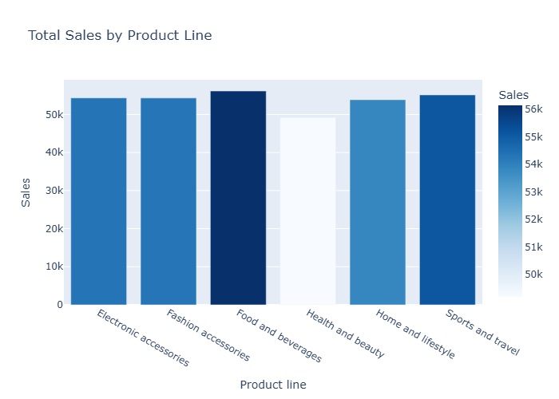
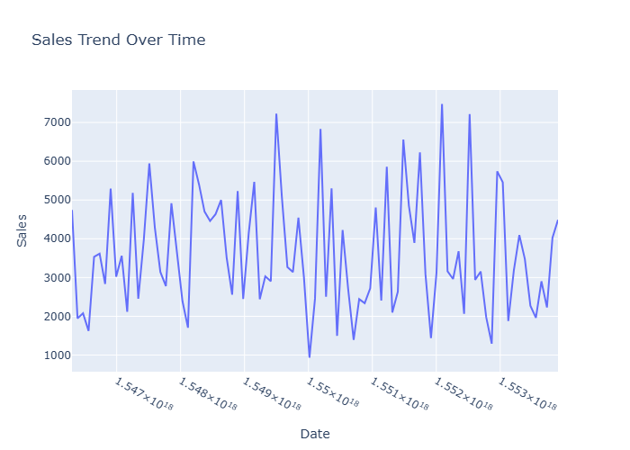
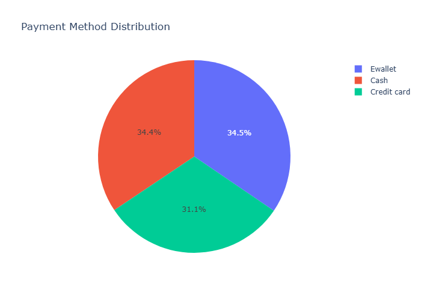
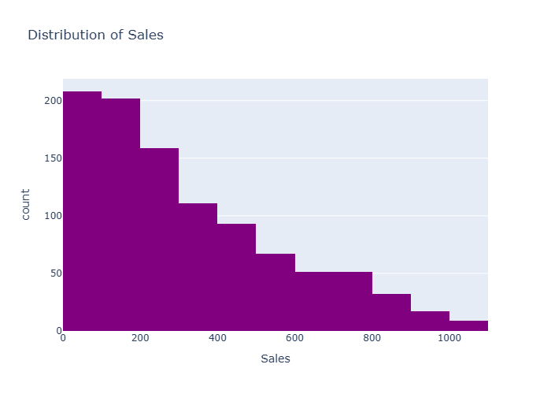
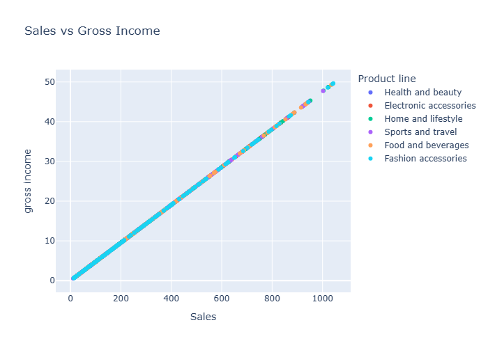
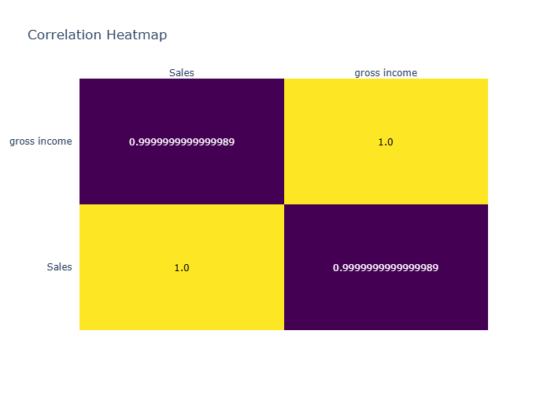

# Supermarket Sales Analysis with Python & Plotly


## 📌 Description
This project analyzes supermarket sales data and visualizes key insights using Python and Plotly. It covers data cleaning, trend analysis, and correlation studies.

## ✨ Features
- Data preprocessing with Pandas
- Interactive charts:
  - Bar chart (Sales by Product Line)
  - Line chart (Sales Trend Over Time)
  - Pie chart (Payment Method Distribution)
  - Histogram (Sales Distribution)
  - Scatter plot (Sales vs Gross Income)
  - Heatmap (Correlation Matrix)

## 🛠 Technologies Used
- Python
- Pandas
- Plotly

## 📂 Installation
```bash
git clone <your-repo-link>
cd <your-repo-folder>
pip install -r requirements.txt
```

## ▶ Usage
Run the script:
```bash
python supermarket_analysis.py
```

## 📊 Dataset
The dataset includes columns like:
`Invoice ID, Branch, City, Customer type, Gender, Product line, Unit price, Quantity, Tax 5%, Sales, Date, Time, Payment, cogs, gross income, Rating`

## 📈 Visualizations
Add screenshots of your charts here:
- 
- 
- 
- 
- 
- 

## 📜 License
This project is licensed under the MIT License.
